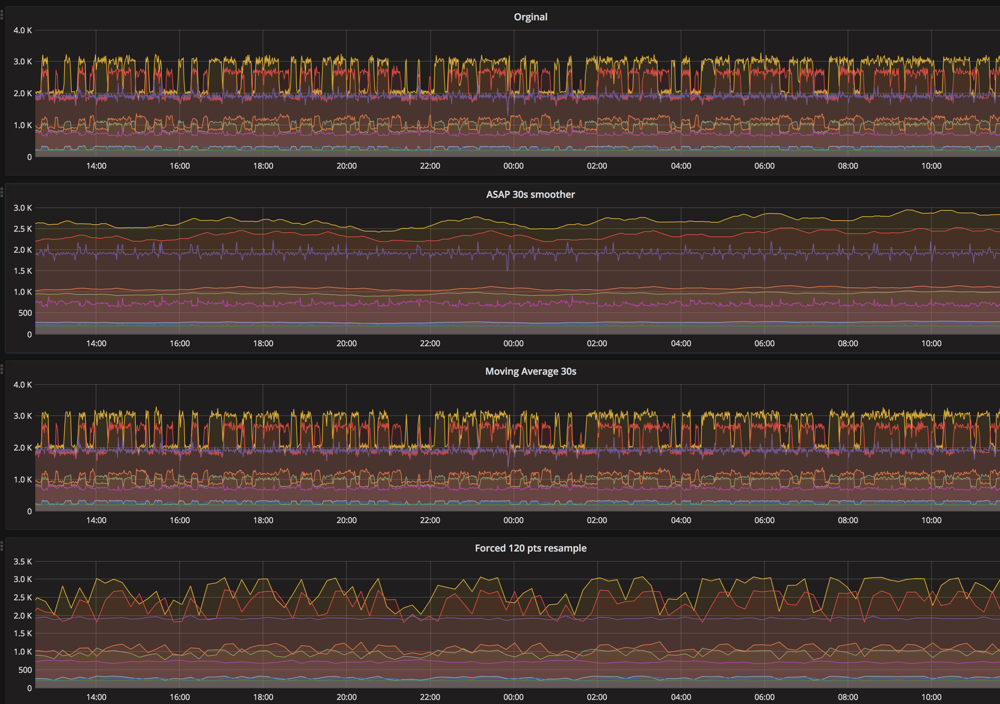

# Graphite-ASAP

This is a custom Graphite function for the ASAP dynamic smoothing algorithm

https://arxiv.org/pdf/1703.00983.pdf

http://github.com/stanford-futuredata/ASAP

Adapted from Graphite-api version https://github.com/wyndhblb/graphite_asap

This requires Graphite-web version 1.1.1 or newer and installed [`numpy`](http://www.numpy.org/).

# Install

Copy `asap.py` and `functions.py` to `/opt/graphite/webapp/graphite/functions/custom` directory and restart Graphite-web. Check output of `http://<graphiteurl>/functions?pretty=1`, function `asap()` should be present.

Check [Function Plugin documentation](https://graphite.readthedocs.io/en/latest/functions.html#function-plugins) for details.

## Note On Nulls

If you data as "nulls/Nones" in the data list, it will FORCE them to be 0, otherwise
the algorithm cannot really function, as it needs to be able to dynamically compute windowing layers.

## Notes on the ASAP algo

This is a dynamic windowing algorithm, meaning that the returned vector is NOT necessarily going to be the same
length as the one you wish.  If you want a 500 point vector back you can easily get much lower then that if
the windowing deems it ok.  For very "flat" data (i.e. sigma^4 is very small) you may even just get a few points.

In your graphing world it's recommended you use "connected" lines, not just points, as the returned data can be
very sparse.

### Steps

What this means is that the "step" (or delta time between points) may not be an int, but a float.  Unfortunately, 
graphite does not like floats for the steps size. 

Graphite-web, when using the Graphing (not the json) output actually does ok with floats, the json writer does not,
and so we must attempt to round the resulting step size.  
As a result your graphs may look like there is the data does not transport all the way to the end of the graph due 
to what appears to be a "timeshift" because the time step over the run of a few hundred points with out the
floating point precision will loose (or gain) too much time between steps.

(There is probably an easy interpolation sort of fix for this, just have not implemented it yet)

## TODO

No numpy version (probably will be too slow, but worth checking).

## Usage

Using your favorite query engine
    
    # attempt to get a vector with 10second steps
    http://xxx/render?target=asap(path.to.metric, '10s')
    
    # attempt to get a vector that has roughly this number of points
    http://xxx/render?target=asap(path.to.metric, 100)

## In action
 

